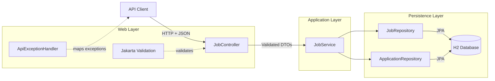
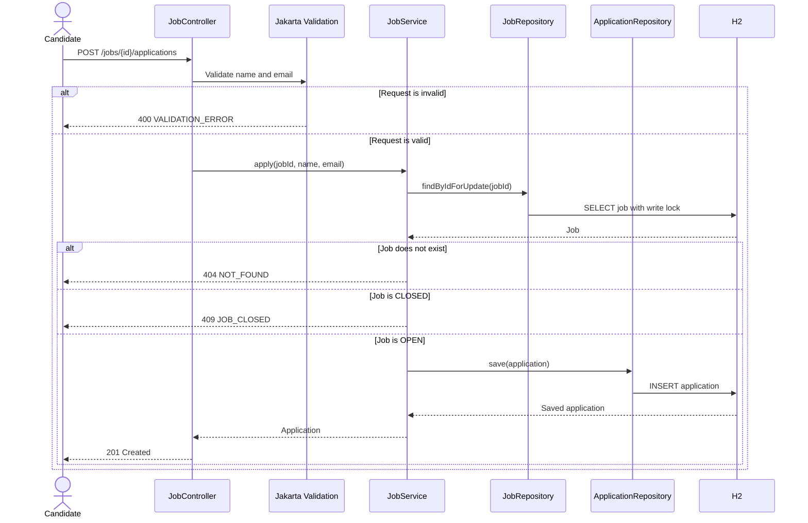
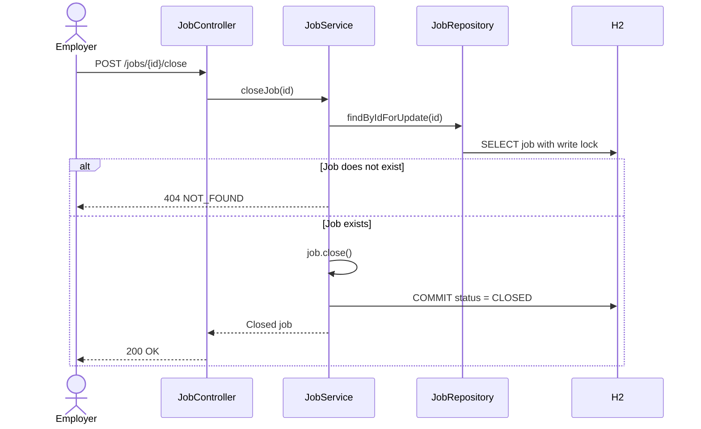
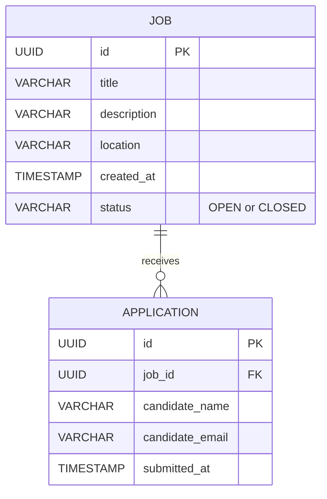
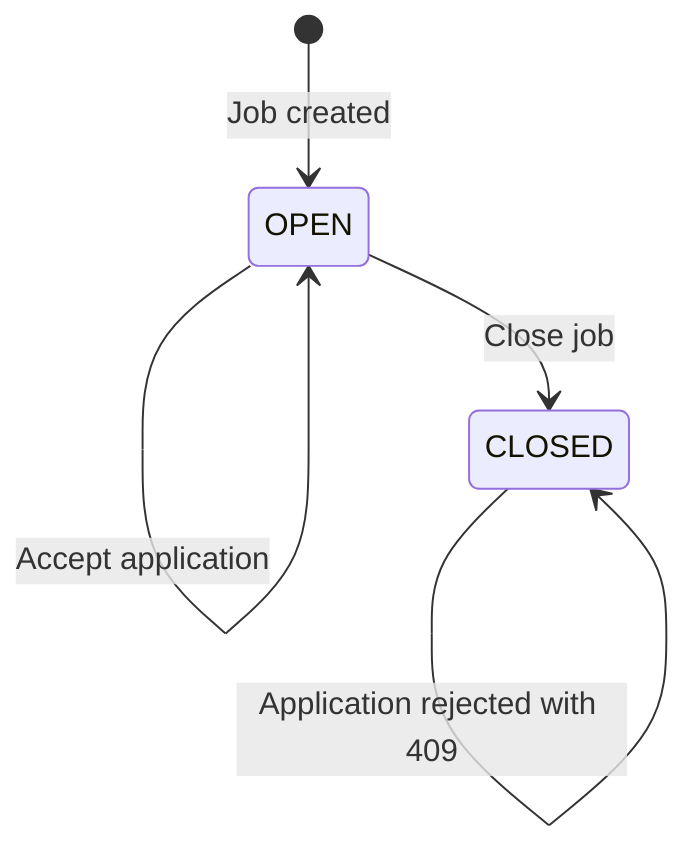

# System Diagrams

These diagrams use Mermaid and render directly on GitHub.

## Component and request flow

## Submit application sequence

## Close job sequence

The same job-row lock is used when closing and applying. Those operations therefore cannot update the same job concurrently, protecting the rule that a closed job must not accept a new application.

## Data model

## Job lifecycle

